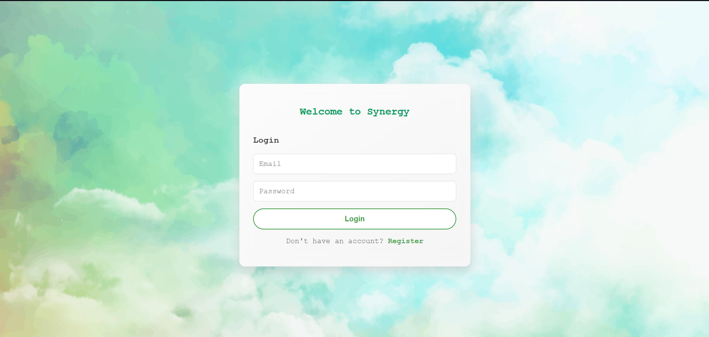
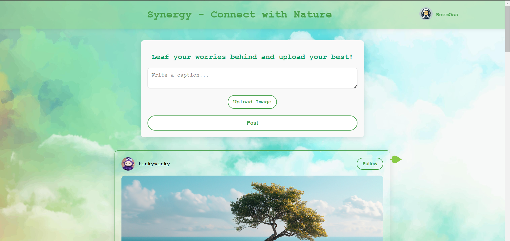
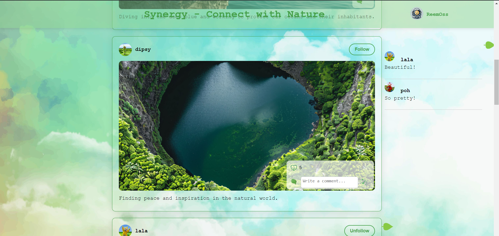
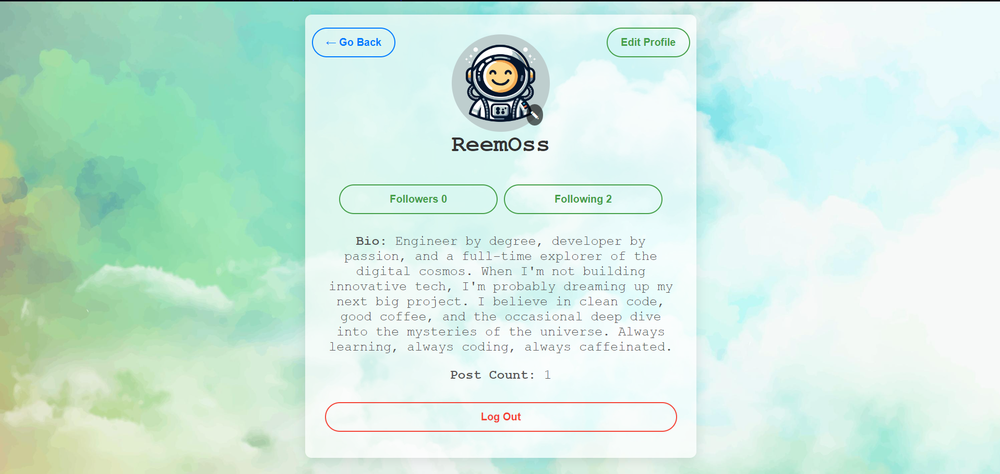

# Synergy

**Synergy** is a social media platform where users can share their love for nature. The platform allows users to post their personal nature-related photos, like and comment on other users' posts, and engage with a community that shares a passion for the environment. This project was developed as part of my Full Stack Developer internship at CodeAlpha.

## Project Overview

Synergy is designed to bring together people who appreciate the beauty of nature. The platform is simple yet powerful, focusing on core social media functionalities without overwhelming users with unnecessary features. It offers a clean and intuitive interface where users can easily navigate and interact with posts.

## Key Features

- **User Authentication:** Users can register and log in to the platform securely.
- **Post Creation:** Users can create posts with images and captions to share their experiences in nature.
- **Likes and Comments:** Users can like and comment on posts to engage with the community.
- **Profile Management:** Each user has a profile where they can view their posts and manage their account.
- **Responsive Design:** The platform is designed to work seamlessly on both desktop and mobile devices.

## Screenshots

*The user will be first prompted to login or register.*

*The main page showcases the posts and and a post form in case the user wants to post an image.*

*The posts have a unique way for liking and commenting. The comments can be expanded by clicking on the green leaf on the top right corner of the post container. The user can follow/unfollow users.*

*In the profile page, the user has the options of editing their profile information, viewing their followers and followings, viewing their post count, changing their profile picture, as well as loging out.*

## Technologies Used

- **Frontend:** HTML, CSS, JavaScript
- **Backend:** Node.js, Express.js
- **Database:** MongoDB
- **Version Control:** Git, GitHub

## Future Enhancements

- **Direct Messaging:** Implementing a direct messaging feature for users to interact privately.
- **Advanced Search:** Enabling users to search for posts by keywords, tags, or users.
